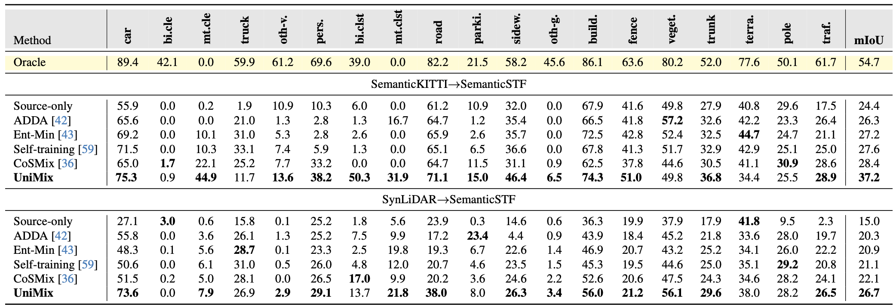
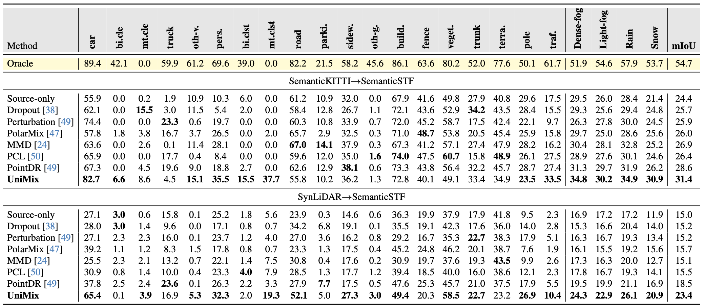

<h1 align="center">UniMix: Towards Domain Adaptive and Generalizable LiDAR Semantic Segmentation in Adverse Weather
</h1>
<p align="center">
<a href="[https://arxiv.org/abs/2404.05145](https://arxiv.org/abs/2404.05145)">.svg" ></a>
<h4 align="center">This is the official repository of the paper <a href="https://arxiv.org/abs/2404.05145">UniMix: Towards Domain Adaptive and Generalizable LiDAR Semantic Segmentation in Adverse Weather</a>.</h4>
<h5 align="center"><em>Haimei Zhao, Jing Zhang, Zhuo Chen, Shanshan Zhao, and Dacheng Tao</em></h5>
<p align="center">
  <a href="#news">News</a> |
  <a href="#abstract">Abstract</a> |
  <a href="#method">Method</a> |
  <a href="#results">Results</a> |
  <a href="#preparation">Preparation</a> |
  <a href="#code">Code</a> |
  <a href="#statement">Statement</a>
</p>

## News
- **(2024/2/27)** UniMix is accepted by CVPR 2024!
- **(2024/2/27)** UniMix is released on [arXiv](https://arxiv.org/abs/2404.05145).

## Abstract

LiDAR semantic segmentation (LSS) is a critical task in autonomous driving and has achieved promising progress. However, prior LSS methods are conventionally investigated and evaluated on datasets within the same domain in clear weather. The robustness of LSS models in unseen scenes and all weather conditions is crucial for ensuring safety and reliability in real applications. To this end, we propose UniMix, a universal method that enhances the adaptability and generalizability of LSS models. UniMix first leverages physically valid adverse weather simulation to construct a Bridge Domain, which serves to bridge the domain gap between the clear weather scenes and the adverse weather scenes. Then, a Universal Mixing operator is defined regarding spatial, intensity, and semantic distributions to create the intermediate domain with mixed samples from given domains. Integrating the proposed two techniques into a teacher-student framework, UniMix efficiently mitigates the domain gap and enables LSS models to learn weather-robust and domain-invariant representations. We devote UniMix to two main setups: 1) unsupervised do-main adaption, adapting the model from the clear weather source domain to the adverse weather target domain; 2) domain generalization, learning a model that generalizes well to unseen scenes in adverse weather. Extensive experiments validate the effectiveness of UniMix across different tasks and datasets, all achieving superior performance over state-of-the-art methods.
## Method


## Results

### Quantitative results on Nuscenes validation set



## Installation
The code has been tested with Docker (see Docker container below) with Python 3.8, CUDA 10.2/11.1, pytorch 1.8.0 and pytorch-lighting 1.4.1.
Any other version may require to update the code for compatibility.

### Pip/Venv/Conda
In your virtual environment follow [MinkowskiEnginge](https://github.com/NVIDIA/MinkowskiEngine).
This will install all the base packages.

Additionally, you need to install:
- [open3d 0.13.0](http://www.open3d.org)
- [pytorch-lighting 1.4.1](https://www.pytorchlightning.ai)
- [wandb](https://docs.wandb.ai/quickstart)
- tqdm
- pickle

## Data preparation

### SynLiDAR
Download SynLiDAR dataset from [here](https://github.com/xiaoaoran/SynLiDAR), then prepare data folders as follows:
```
./
├── 
├── ...
└── path_to_data_shown_in_config/
    └──sequences/
        ├── 00/           
        │   ├── velodyne/	
        |   |	├── 000000.bin
        |   |	├── 000001.bin
        |   |	└── ...
        │   └── labels/ 
        |       ├── 000000.label
        |       ├── 000001.label
        |       └── ...
        └── 12/
```

### SemanticKITTI
To download SemanticKITTI follow the instructions [here](http://www.semantic-kitti.org). Then, prepare the paths as follows:
```
./
├── 
├── ...
└── path_to_data_shown_in_config/
      └── sequences
            ├── 00/           
            │   ├── velodyne/	
            |   |	   ├── 000000.bin
            |   |	   ├── 000001.bin
            |   |	   └── ...
            │   ├── labels/ 
            |   |      ├── 000000.label
            |   |      ├── 000001.label
            |   |      └── ...
            |   ├── calib.txt
            |   ├── poses.txt
            |   └── times.txt
            └── 08/
```
## SemanticSTF dataset
Download SemanticSTF dataset from [GoogleDrive](https://forms.gle/oBAkVJeFKNjpYgDA9), [BaiduYun](https://pan.baidu.com/s/10QqPZuzPclURZ6Niv1ch1g)(code: 6haz). Data folders are as follows:
The data should be organized in the following format:
```
/SemanticSTF/
  └── train/
    └── velodyne
      └── 000000.bin
      ├── 000001.bin
      ...
    └── labels
      └── 000000.label
      ├── 000001.label
      ...
  └── val/
      ...
  └── test/
      ...
  ...
  └── semanticstf.yaml
```

## Code
Coming Soon...
## Statement
@article{zhao2024unimix,
  title={UniMix: Towards Domain Adaptive and Generalizable LiDAR Semantic Segmentation in Adverse Weather},
  author={Zhao, Haimei and Zhang, Jing and Chen, Zhuo and Zhao, Shanshan and Tao, Dacheng},
  journal={arXiv preprint arXiv:2404.05145},
  year={2024}
}

