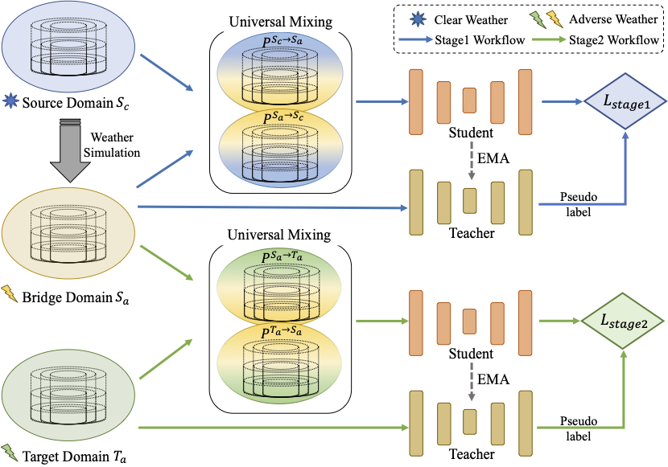

<h1 align="center">UniMix: Towards Domain Adaptive and Generalizable LiDAR Semantic Segmentation in Adverse Weather
</h1>
<p align="center">
<a href="[https://arxiv.org/abs/2404.05145](https://arxiv.org/abs/2404.05145)">.svg" ></a>
<h4 align="center">This is the official repository of the paper <a href="https://arxiv.org/abs/2404.05145">UniMix: Towards Domain Adaptive and Generalizable LiDAR Semantic Segmentation in Adverse Weather</a>.</h4>
<h5 align="center"><em>Haimei Zhao, Jing Zhang, Zhuo Chen, Shanshan Zhao, and Dacheng Tao</em></h5>
<p align="center">
  <a href="#news">News</a> |
  <a href="#abstract">Abstract</a> |
  <a href="#method">Method</a> |
  <a href="#results">Results</a> |
  <a href="#preparation">Preparation</a> |
  <a href="#code">Code</a> |
  <a href="#statement">Statement</a>
</p>

## News
- **(2024/2/27)** UniMix is accepted by CVPR 2024!
- **(2024/2/27)** UniMix is released on [arXiv](https://arxiv.org/abs/2404.05145).

## Abstract

LiDAR semantic segmentation (LSS) is a critical task in autonomous driving and has achieved promising progress. However, prior LSS methods are conventionally investi- gated and evaluated on datasets within the same domain in clear weather. The robustness of LSS models in un- seen scenes and all weather conditions is crucial for ensur- ing safety and reliability in real applications. To this end, we propose UniMix, a universal method that enhances the adaptability and generalizability of LSS models. UniMix first leverages physically valid adverse weather simulation to construct a Bridge Domain, which serves to bridge the domain gap between the clear weather scenes and the ad- verse weather scenes. Then, a Universal Mixing operator is defined regarding spatial, intensity, and semantic distri- butions to create the intermediate domain with mixed sam- ples from given domains. Integrating the proposed two tech- niques into a teacher-student framework, UniMix efficiently mitigates the domain gap and enables LSS models to learn weather-robust and domain-invariant representations. We devote UniMix to two main setups: 1) unsupervised do- main adaption, adapting the model from the clear weather source domain to the adverse weather target domain; 2) domain generalization, learning a model that generalizes well to unseen scenes in adverse weather. Extensive exper- iments validate the effectiveness of UniMix across different tasks and datasets, all achieving superior performance over state-of-the-art methods.
## Method


## Results

### Quantitative results on Nuscenes validation set

### Qualitative results


## Preparation

### Prerequisites

The code is built with following libraries:

- Python >= 3.8, \<3.9
- OpenMPI = 4.0.4 and mpi4py = 3.0.3 (Needed for torchpack)
- Pillow = 8.4.0 (see [here](https://github.com/mit-han-lab/bevfusion/issues/63))
- [PyTorch](https://github.com/pytorch/pytorch) >= 1.9, \<= 1.10.2
- [tqdm](https://github.com/tqdm/tqdm)
- [torchpack](https://github.com/mit-han-lab/torchpack)
- [mmcv](https://github.com/open-mmlab/mmcv) = 1.4.0
- [mmdetection](http://github.com/open-mmlab/mmdetection) = 2.20.0
- [nuscenes-dev-kit](https://github.com/nutonomy/nuscenes-devkit)

After installing these dependencies, please run this command to install the codebase:

```bash
python setup.py develop
```
### Data Preparation

#### nuScenes

Please follow the instructions from [here](https://github.com/open-mmlab/mmdetection3d/blob/master/docs/en/datasets/nuscenes_det.md) to download and preprocess the nuScenes dataset. Please remember to download both detection dataset and the map extension (for BEV map segmentation). After data preparation, you will be able to see the following directory structure (as is indicated in mmdetection3d):

```
mmdetection3d
├── mmdet3d
├── tools
├── configs
├── data
│   ├── nuscenes
│   │   ├── maps
│   │   ├── samples
│   │   ├── sweeps
│   │   ├── v1.0-test
|   |   ├── v1.0-trainval
│   │   ├── nuscenes_database
│   │   ├── nuscenes_infos_train.pkl
│   │   ├── nuscenes_infos_val.pkl
│   │   ├── nuscenes_infos_test.pkl
│   │   ├── nuscenes_dbinfos_train.pkl

```

## Code
### Setup
```bash
python setup.py develop
```
### Training
```bash
different loss items should be changed in configs/nuscenes/det/centerhead/lssfpn/camera/256x704/swint/convfuser.yaml

and different backbone networks can be choosed, including swinT, vitaev2, and bevformer in configs/nuscenes/det/centerhead/lssfpn/camera/256x704/

torchpack dist-run -np 8 python tools/train.py configs/nuscenes/det/centerhead/lssfpn/camera/256x704/swint/convfuser.yaml --data.samples_per_gpu 3 --max_epochs 20 --data.workers_per_gpu 6 --run-dir swinT-twobranchesloss --load_from ../bevfusion-main/pretrained/bevfusion-det.pth
```
### Evaluation
```bash
torchpack dist-run -np 8 python tools/test.py configs/nuscenes/det/centerhead/lssfpn/camera/256x704/swint/convfuser.yaml --xxx.pth --eval bbox
```

## Statement
@inproceedings{zhao2024simdistill,
title={SimDistill: Simulated Multi-Modal Distillation for BEV 3D Object Detection},
author={Zhao, Haimei and Zhang, Qiming and Zhao, Shanshan and Chen, Zhe and Zhang, Jing and Tao, Dacheng},
booktitle={Proceedings of the AAAI Conference on Artificial Intelligence},
volume={38},
number={7},
pages={7460--7468},
year={2024}
}

